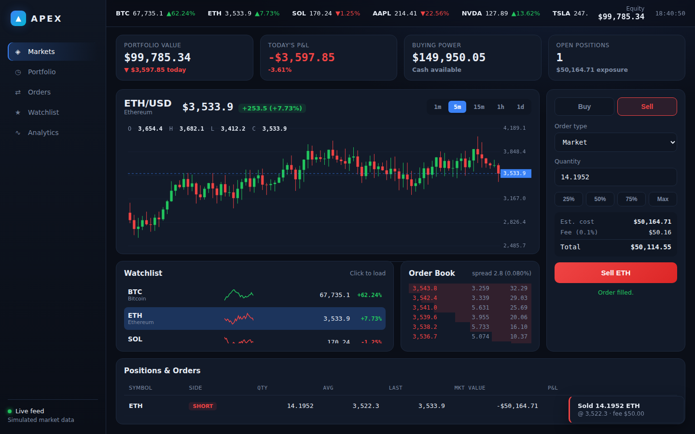

# APEX Terminal — Trader Dashboard

A self-contained, single-page trading dashboard with a dark "pro terminal"
aesthetic. Built with plain HTML, CSS, and vanilla JavaScript — **no build
step and no external dependencies**. All charts are drawn directly on
`<canvas>`, and market data is simulated locally so the dashboard works fully
offline.



## Features

- **Live price feed (simulated)** — eight instruments (crypto, equities, FX,
  gold) tick continuously with realistic volatility per asset.
- **Candlestick chart** drawn on canvas, with `1m / 5m / 15m / 1h / 1d`
  timeframes, live price line, OHLC overlay, and price axis.
- **Order ticket** — Market / Limit / Stop order types, Buy/Sell tabs,
  quick-size pills (25/50/75/Max), live cost + fee + total estimate, and
  buying-power validation.
- **Order book** — synthetic bid/ask ladder with depth bars and live spread.
- **Watchlist** with per-symbol sparklines and % change; click to load any
  symbol into the chart and ticket.
- **Positions & orders table** — long/short positions with average price,
  market value, and live P&L, plus one-click close.
- **KPI header** — portfolio value, today's P&L, buying power, open positions,
  and total exposure, all updating in real time.
- **Toasts** confirm every fill, and the top ticker strip scrolls live quotes.
- **Responsive** layout that collapses gracefully on narrow screens.

## Run it

No tooling required — just open the file:

```bash
# from the repo root
open trader-dashboard/index.html        # macOS
xdg-open trader-dashboard/index.html    # Linux
```

Or serve it (recommended so the browser treats it as a normal origin):

```bash
cd trader-dashboard
python3 -m http.server 8080
# then visit http://localhost:8080
```

## How the simulation works

- Each instrument has a base price and a volatility factor. On load, seeded
  candle history is generated for every timeframe.
- A tick loop (every ~0.9s) applies a random shock to each price, updates the
  current candle, and occasionally rolls a new bar.
- Trades adjust a local cash balance and position book. Buys spend buying
  power, sells/shorts add to it, and a 0.1% fee is applied to every fill.
- Everything is in-memory — refresh to reset to the starting $100,000 balance.

## Files

| File | Purpose |
| --- | --- |
| `index.html` | Layout and panel structure |
| `styles.css` | Dark terminal theme, grid layout, components |
| `app.js` | Market simulation, canvas charts, trading logic, rendering |

> This is a front-end demo for design/UX purposes. It does **not** connect to
> any exchange and places no real orders.
