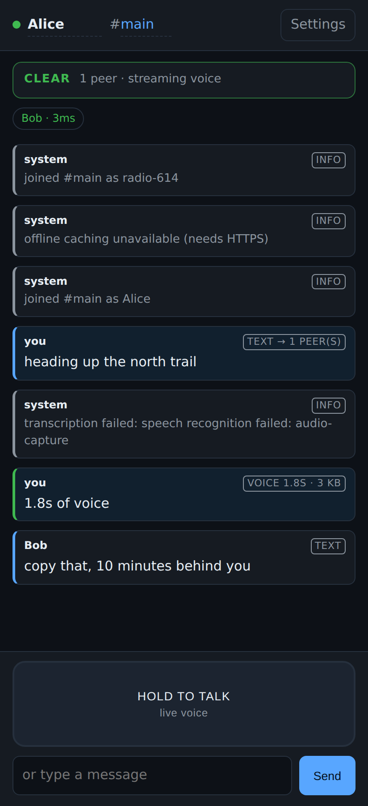
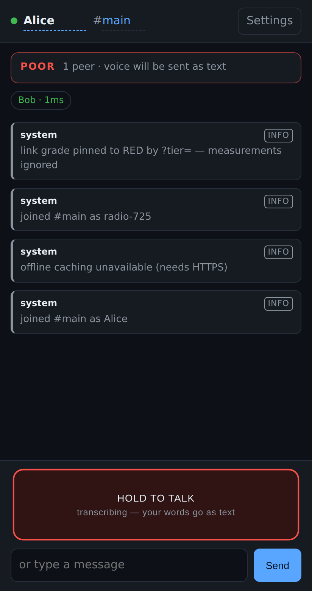

# Nearby PTT

A push-to-talk walkie-talkie that runs in the browser and talks to other phones
on the same Wi-Fi or hotspot, with no account, no cloud and no internet.

Its one real idea: **when the link gets too weak to carry your voice, the app
transcribes you on the device and sends the sentence instead, and the phone at
the other end reads it out loud.** You hold the button and talk; the person you
are talking to hears a voice. What crossed the gap in between was 60 bytes of
text rather than 30 KB of Opus.



## Why bother — what already exists

Worth being blunt: this category is crowded, and most of it is better funded
than anything built in an afternoon.

| App | What it does | Where it stops |
|---|---|---|
| [Zello](https://zello.com/) | The dominant PTT app, ~150M users | Internet only — useless when the network is down |
| [Bridgefy](https://bridgefy.me/) | Bluetooth/Wi-Fi mesh messaging, ~12M users | Text, not voice |
| [Briar](https://briarproject.org/) | Bluetooth / Wi-Fi Direct / Tor, audited, open source | Text, not voice |
| BitChat | Bluetooth mesh, no account, rotating IDs | Text, not voice |
| [Meshtastic](https://meshtastic.org/) / MeshCore | LoRa mesh, kilometres of range | Needs extra hardware; far too slow for voice |
| "Offline walkie talkie" apps on Play Store | PTT over LAN / Wi-Fi Direct / Bluetooth | Same-network voice only; nothing degrades gracefully |

So: offline **text** mesh is solved several times over, and same-network
**voice** PTT exists. What nobody in that list does is treat voice and text as
two encodings of the same message and switch between them based on what the
radio can actually carry. That is the gap this app aims at.

The honest counterweight: offline mesh apps have repeatedly failed
commercially, because they only matter when infrastructure is down, which is
rare, so nobody installs them beforehand. FireChat is dead; Serval is dead.
Treat this as a strong technical project, not an obvious business.

## The hard constraint nobody mentions up front

**A web app cannot do phone-to-phone Bluetooth.** Web Bluetooth only implements
the GATT *central* role, so a browser can talk to a heart-rate monitor but not
to another browser. There is no peripheral role and no Web Bluetooth on iOS
Safari at all.

That leaves one transport for a PWA: a shared local network. In practice that
means one phone puts up a hotspot and everyone else joins it, or everyone is on
the same Wi-Fi. Range is the hotspot's range — call it 30–50 m indoors — not the
kilometre you would get from an actual walkie-talkie.

If you need real Bluetooth or Wi-Fi Direct between phones, the app has to be
native Android. That is a different project, and the protocol and tier logic in
`public/src/protocol.js` and `public/src/link-quality.js` port over unchanged.

## Running it

```bash
npm install
npm run certs        # self-signed cert covering this machine's LAN addresses
npm start            # https://<your-lan-ip>:8443
```

Open that URL on every phone. Each one has to tap through the certificate
warning once. Then set a name, share a channel name, and hold the big button.

The server only introduces peers to each other. Once two browsers have shaken
hands, every frame goes directly between them — you can kill the server and the
conversation keeps working.

`npm test` runs the protocol and link-grading tests (18 of them, all passing).

### Demoing the degraded path

The interesting behaviour only shows up on a bad link, which is hard to arrange
on purpose. Append `?tier=red` to the URL to pin the grade and force the
transcription path regardless of the real measurements.



## How it works

```
mic ──┬─→ MediaRecorder (Opus) ──→ AUDIO_* frames ──→ unreliable data channel
      └─→ PCM tap ──→ on-device STT ──→ VOICE_AS_TEXT ──→ reliable data channel
                                                              │
                                          receiver ───────────┴──→ speech synthesis
```

Both paths run **at the same time**, on every transmission. That is what makes
the switch instant: the transcript is already finished when you release the
button, so a link that collapses mid-sentence still delivers the sentence
(`collapsed: true` in the frame metadata, shown as "link dropped → text" in the
log). Capturing both costs some CPU and nothing on the wire.

`link-quality.js` grades each peer continuously from round-trip time, ping loss
and measured goodput, and maps the grade to a transmit profile:

| Grade | Condition | What a held button does |
|---|---|---|
| CLEAR | < 180 ms, < 3% loss, > 6 kB/s | 24 kbps Opus streamed live in 220 ms slices |
| WEAK | < 700 ms, < 20% loss, > 1.2 kB/s | 10 kbps Opus, 1 s slices, played on release |
| POOR | anything worse | transcribed on device, sent as text, spoken at the far end |

Two details that took a bug each to get right:

- **An unmeasured link is not a slow one.** Grading a fresh peer's unknown
  goodput as zero pinned it to POOR, so it never sent audio, so goodput stayed
  unknown. Absent measurements now sit out until a real sample exists, and every
  fourth ping carries 8 KB of padding so a real sample arrives within seconds.
- **Grades are hysteretic**, and fall faster than they rise (2 samples down, 4
  up). A grade that flaps mid-sentence costs a codec restart at both ends.

Frames relay up to 4 hops, deduplicated by `(type, message id, sequence)`.
Keying that on the message id alone silently swallowed every `AUDIO_END`,
because a transmission deliberately reuses one id across its start, chunks and
end — see the regression test in `test/protocol.test.js`.

## Transcription engines

| Engine | Offline? | Notes |
|---|---|---|
| Web Speech API | **No** on most Chrome builds — audio goes to Google | Zero install, the convenient default |
| whisper-tiny via transformers.js | **Yes**, after a one-time ~40 MB download | The one that actually holds up with no infrastructure |

Settings → *Download voice pack* fetches whisper while you still have a
connection; after that it lives in the browser cache and every transcription is
on-device. An offline-first app whose fallback needs the internet would be a
joke, so the honest recommendation is to fetch the pack before you need it.

## Known limitations

- **Service workers need a genuinely trusted certificate.** Chrome refuses to
  register one on an origin whose certificate you merely clicked through, so
  offline install does not work with the self-signed cert out of the box. Fix it
  by installing the CA on the phone, or by launching Chrome with
  `--unsafely-treat-insecure-origin-as-secure=https://<ip>:8443`.
- **Nothing is encrypted above the transport.** WebRTC data channels are DTLS
  encrypted hop by hop, but there is no end-to-end key exchange and no identity
  verification, so a relaying peer can read what it forwards. Do not use this
  where that matters.
- **Peer discovery needs the signalling server reachable at least once.** Two
  phones that have never met cannot find each other with the server down.
- **No store-and-forward yet.** A message to a peer who is out of range is lost,
  not carried until they reappear.
- Transcription accuracy, speech synthesis and audio playback were not verified
  here — the headless browser used for testing has no speech engine and no audio
  output. The transport, the grading and the fallback switching were all
  verified end to end between two real browser peers.

## Layout

```
server/index.js          introductions + static hosting; never sees message content
public/src/protocol.js   binary frame format, relay dedupe
public/src/link-quality.js  per-peer grading and transmit profiles
public/src/mesh.js       WebRTC peer mesh, ping/probe loop, relaying
public/src/ptt.js        dual-path capture and the release-time decision
public/src/stt.js        pluggable transcription (Web Speech / whisper)
public/src/tts.js        speech synthesis, stable voice per peer
public/src/player.js     live MSE playback with a clip-queue fallback
```
